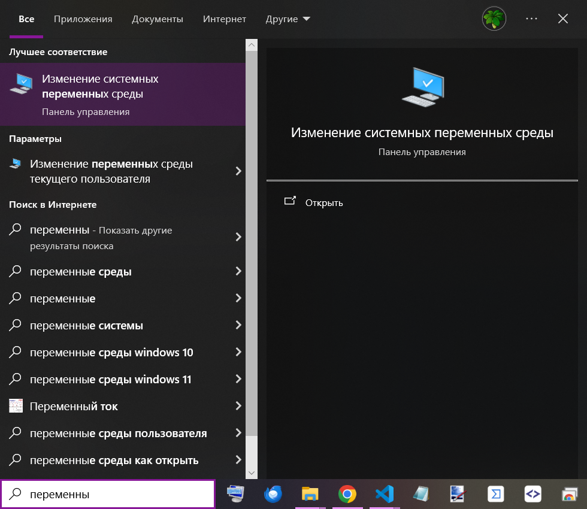
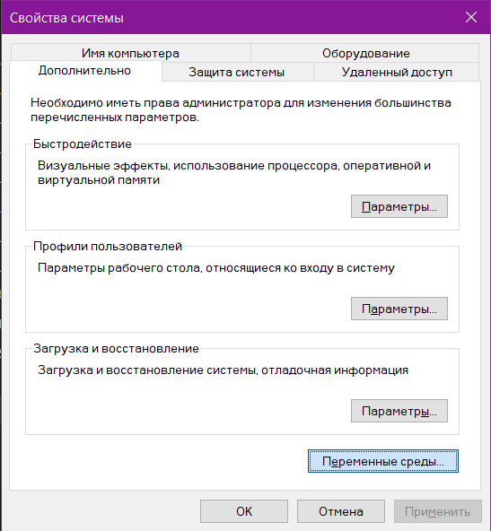
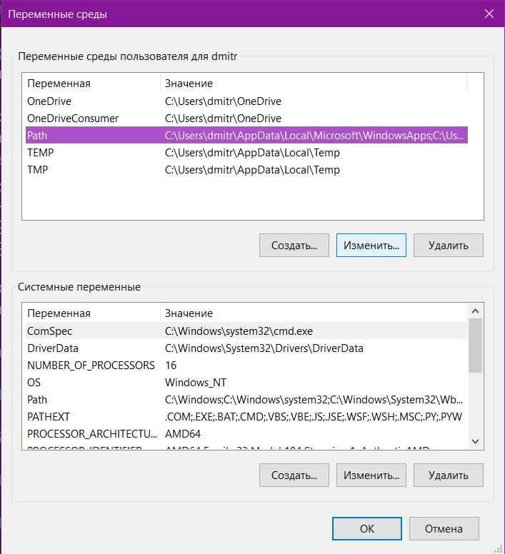
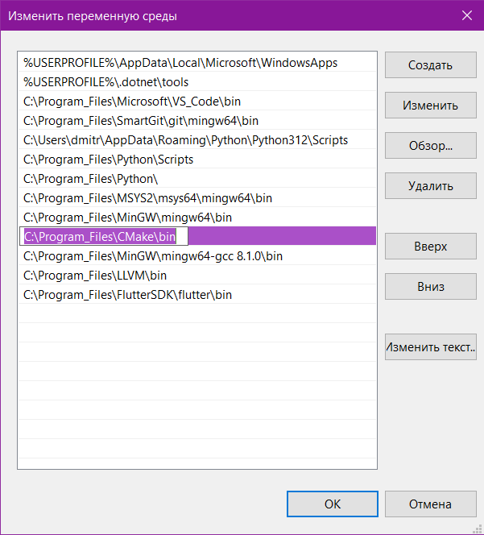
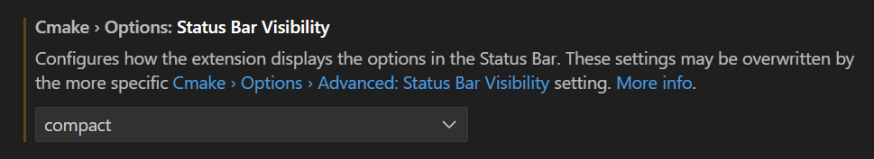
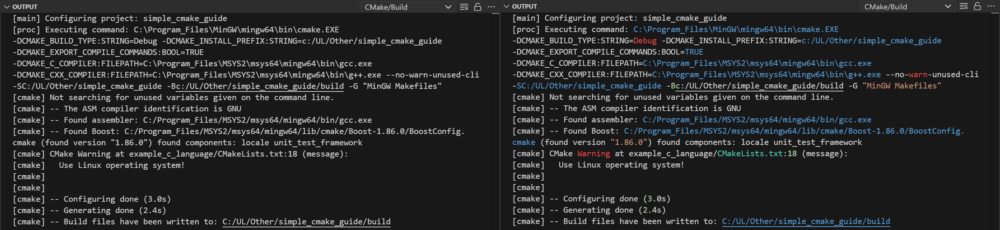

# Simple CMake Guide

Этот репозиторий представляет собой небольшой гайд по использованию [CMake](https://cmake.org) и различных его фишек в учебных проектах для студентов первого курса МФТИ ФАЛТ ([ПИШ РПИ](https://mipt-rse.ru)). 

Гайд написан другим студентом, а потому может содержать ошибки, неточности, непрофессиональную лексику и т.п.

Убедительная просьба отнестись с понимаем и обо всём таком писать в [`Issues`](https://github.com/UmbrellaLeaf5/simple_cmake_guide/issues) :)

## Contents
  * [CMake configuring in VS Code](#cmake-configuring-in-vs-code)
  * [Repo configuring recommendations](#repo-configuring-recommendations)
  * [Example 1: Hello World!](#example-1-hello-world)
  * [Example 2: Stroustrup calculator](#example-2-stroustrup-calculator)
  * [Example 3: Using Eigen library](#example-3-using-eigen-library)
  * [Example 4: Using FLTK library](#example-4-using-fltk-library)
  * [Example 5: Using Nlohmann/json library](#example-5-using-nlohmannjson-library)
  * [Example 6: Complex CMake project](#example-6-complex-cmake-project)
  * [Example 7&8: Another languages projects](#example-78-another-languages-projects)
  * [Useful links](#useful-links)

## CMake configuring in VS Code

Так как подавляющее большинство на первом курсе использует [VS Code](https://code.visualstudio.com) в качестве редактора кода (искренне одобряется :), я решил включить сюда небольшие рекомендации по интегрированию CMake в эту среду разработки для его удобного использования.

### CMake

Перед настройкой внутри VS Code, сначала необходимо установить сам CMake и добавить его в Переменные Среды вашего устройства (далее `PATH`).

Самый простой способ это сделать в случае операционной системы Windows - скачать архив с бинарными файлами и распаковать его в удобную вам папку (например, `C:\Program_Files\CMake`) по этой [ссылке](https://github.com/Kitware/CMake/releases/download/v3.31.0-rc3/cmake-3.31.0-rc3-windows-x86_64.zip). Далее путь к нему необходимо добавить в `PATH`. Вот так это выглядит под Windows 10:

 ->
 -> 
 ->

<!-- 


 -->

Варианты для других операционных систем и системных конфигураций также можно найти на странице загрузки CMake: https://cmake.org/download.

### VS Code

В самом VS Code необходимо скачать расширение: **[CMake Tools](https://marketplace.visualstudio.com/items?itemName=ms-vscode.cmake-tools)** 
> CMake Tools provides the native developer a full-featured, convenient, and powerful workflow for CMake-based projects in Visual Studio Code.

И поменять следующую настройку (для удобного отображения `CMake Status Bar` внизу окна):


Также рекомендуется:

[CMake Language Support](https://marketplace.visualstudio.com/items?itemName=josetr.cmake-language-support-vscode) - для подсветки синтаксиса и автоформатирования.

[C/C++ Compile Run](https://marketplace.visualstudio.com/items?itemName=danielpinto8zz6.c-cpp-compile-run) - для подсветки ключевых слов в `Output` (да, целевое назначение этого расширения заключается в компилировании одиночных `.cpp` файлов, с чем оно тоже неплохо справляется, однако его дополнительный функционал не стоит игнорировать). 

До / После: 

## Repo configuring recommendations

Для скачивания материалов репозитория, можно воспользоваться командами
```shell
git clone --recurse-submodules https://github.com/UmbrellaLeaf5/simple_cmake_guide 
```
или
```shell
git clone https://github.com/UmbrellaLeaf5/simple_cmake_guide
git submodule init
git submodule update
```

В этом репозитории используется довольно много различных библиотек, каждую из которых скачивать вручную - не самое приятное занятие. Так что рекомендуется установить сборник инструментов [MSYS2](https://www.msys2.org), в который входят MINGW, Clang, а также есть возможность устанавливать пакеты, используя встроенный терминал и пакетный менеджер `pacman`.

**[Видео-инструкция по установке MSYS2 и настройки FLTK на C++ с помощью него](https://vkvideo.ru/video490206404_456239491)**.

Как и в случае с CMake, необходимо добавить MSYS2 в `PATH`, а далее, запустив терминал `MSYS2 MSYS` (после установки с официального сайта будет добавлен в меню "Пуск"), затем вставить следующие команды для установки необходимых пакетов:

```shell
pacman -S mingw-w64-x86_64-gcc
pacman -S mingw-w64-x86_64-cmake
pacman -S mingw-w64-x86_64-boost
pacman -S gtest
pacman -S mingw-w64-x86_64-gtest
pacman -S mingw-w64-x86_64-eigen3
pacman -S mingw-w64-x86_64-fltk
```

## [Example 1: Hello World!](example_hello_world/)
В этом примере рассматриваются азы написания `CMakeLists.txt` с поэтапным увеличением кол-ва используемых CMake команд ([simple](example_hello_world/simple/), [nice](example_hello_world/nice/) и [good](example_hello_world/good/)).

## [Example 2: Stroustrup calculator](example_calculator/)
В этом примере CMake используется для компиляции примера выполнения второго домашнего задания по C++ в первом семестре.

**! Предупреждение !**

Использование этого примера при попытке сдачи задания своему семинаристу не рекомендуется, так как далеко не все баги исходного кода Бьярне Страуструпа были исправлены в этой версии :) 

## [Example 3: Using Eigen library](example_eigen_package/)
Пример с подключением дополнительной библиотеки для работы с матрицами [Eigen](https://eigen.tuxfamily.org/index.php?title=Main_Page). 

## [Example 4: Using FLTK library](https://github.com/UmbrellaLeaf5/graphic_calculator)
Пример с подключением дополнительной легковесной графической библиотеки [FLTK](https://www.fltk.org).

## [Example 5: Using Nlohmann/json library](example_nlohmann_json_package/)
Пример с клонированием репозитория библиотеки для работы с `.json` файлами [nlohmann/json](https://github.com/nlohmann/json) и её "ручным" подключением к CMake проекту. 

## [Example 6: Complex CMake project](https://github.com/UmbrellaLeaf5/alg_autumn_homeworks)
Пример комплексного CMake проекта, с использованием CMake library и рекурсивным добавлением подпроектов (в данном случае, это репозиторий с домашними работами по предмету "Алгоритмы и структуры данных" 3-го семестра).

## Example 7&8: Another languages projects
[CMake with C](https://github.com/UmbrellaLeaf5/os_homeworks) - пример, где CMake используется для компиляции и сборки проекта на языке программирования C.

**! Предупреждение !**

Компилируется только под Linux-подобными операционными системами!

[CMake with Assembly](https://github.com/UmbrellaLeaf5/assembly_text_task) - пример, где CMake используется для компиляции и сборки проекта на нескольких обратно совместимых языках (C, C++ и язык Ассемблера для архитектуры процессора Intel x86-64).

**! Предупреждение !**

Компилируется только под указанной архитектурой процессора!

## Useful links

ты C++ РАЗРАБОТЧИК?) ага. — Текст : электронный, видеоряд // YouTube : [сайт](https://www.youtube.com/watch?v=CCBH8UQHCW4&ab_channel=Winderton).

CMake Documentation and Community. — Текст : электронный // CMake : [сайт](https://cmake.org/documentation).
